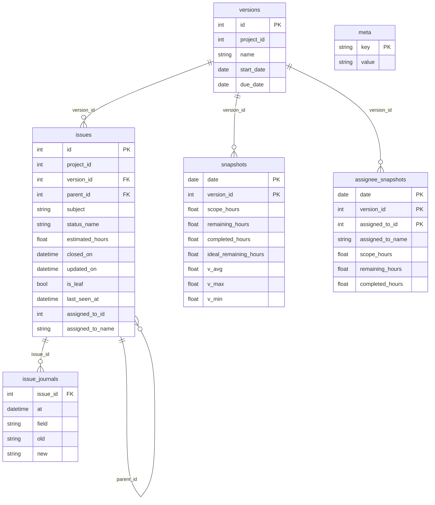

# データモデル (Mermaid ERD)

## 主要な関係性

- **versions** ← **issues**: 1つのVersionに複数のIssueが属する
- **issues** ← **issues**: 親子関係（parent_id による自己参照）
- **issues** ← **issue_journals**: 1つのIssueに複数の変更履歴
- **versions** ← **snapshots**: 1つのVersionに日次スナップショット
- **versions** ← **assignee_snapshots**: 1つのVersionに担当者別日次スナップショット

## 重要なポイント

1. **親子見積ルール**: `issues.parent_id` による階層構造で、
   子チケットがすべて `estimated_hours` を持つ場合は子の合計、
   そうでなければ親の値を採用

2. **担当者管理**: `assigned_to_id` と `assigned_to_name` で担当者を管理。
   NULLは未アサイン課題

3. **履歴追跡**: `issue_journals` で estimated_hours、status_id、
   fixed_version_id、assigned_to_id の変更を記録

4. **日次スナップショット**:
   - `snapshots`: 全体指標（スコープ、残工数、ベロシティなど）
   - `assignee_snapshots`: 担当者別指標

5. **メタデータ**: `meta` テーブルで初期スコープ S0 や
   最終スナップショット日などを保存

## テーブル責務一覧

### versions

スプリント（マイルストーン）のマスタ情報を管理

- **主要データ**: プロジェクトID、名前、開始日、終了日
- **備考**: RedmineのVersionエンティティと対応

### issues

チケット情報とその現在状態を保持

- **主要データ**: 見積工数、ステータス、担当者、親子関係
- **備考**: Redmineから同期される最新状態。階層構造をparent_idで表現

### issue_journals

チケットの変更履歴を時系列で記録

- **主要データ**: 変更日時、変更項目、変更前後の値
- **備考**: スナップショット再生成時に過去の状態を復元するため

### snapshots

日次の全体バーンダウン指標を保存

- **主要データ**: スコープ、残工数、完了工数、理想線、ベロシティ
- **備考**: 23:59 JSTの終値として記録。チャート描画の基礎データ

### assignee_snapshots

日次の担当者別負荷指標を保存

- **主要データ**: 担当者別のスコープ、残工数、完了工数
- **備考**: 担当者別負荷分析とチャート生成のため

### meta

システム設定値とメタ情報を保存

- **主要データ**: 初期スコープS0、最終スナップショット日
- **備考**: 理想線計算や処理継続性のための状態保持
